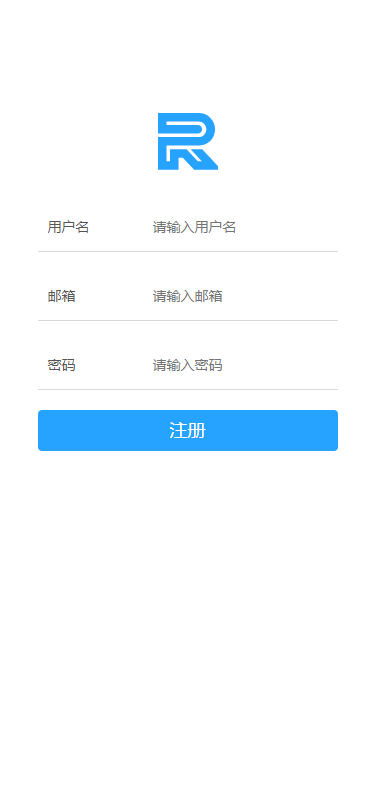
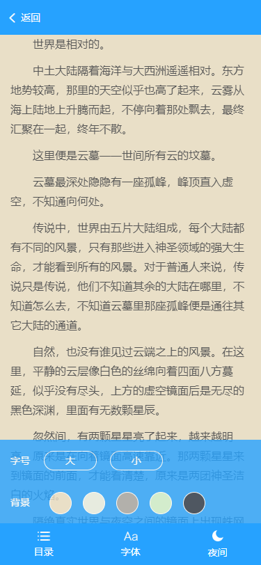
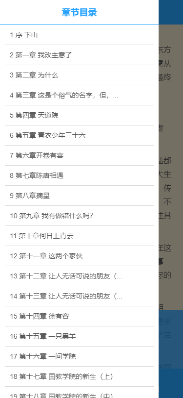
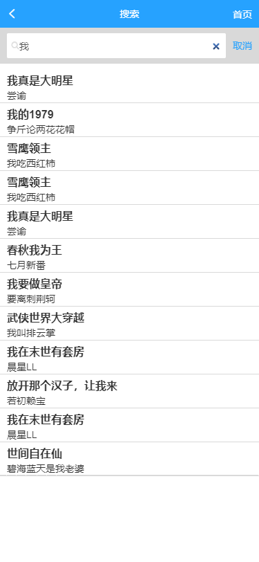

## 基于Vue+Vuex+Nodejs+MySql开发小说阅读器

    参考项目：[https://github.com/tgxhx/vue-reader](https://github.com/tgxhx/vue-reader)
    本文项目：[https://github.com/YepFury/reader](https://github.com/YepFury/reader)
    
技术栈：Vue + Vuex + Vue-router + nodejs + express + mysql 等

说明：在空闲时间，想通过一个项目来总结一下目前的知识体系，因此在参考 [大佬](https://github.com/tgxhx)的项目之后，打算自己实现一遍。

功能：
- [x] 注册（简单的校验）
- [x] 登录
- [x] 首页
- [x] 我的
- [x] 书籍详情
- [x] 分类查看
- [x] 阅读器
- [x] 搜索
- [x] 更改字体大小
- [x] 更改阅读器主题（夜间模式）
- [x] 上下翻页
- [x] 本地存储（账户信息）
- [x] 阅读记录（同步到数据库）
- [x] 书架
- [x] ......
- [ ] 数据获取时的loading、懒加载

### 准备工作
#### 1. 数据导入
本项目在参考项目的基础上增加了登录、注册等功能，因此增加了用户相关的一些表，sql文件[下载地址](https://pan.baidu.com/s/1YBJKqj1q9biAdaDlx0TPDQ)，下载之后导入到MySQL数据库即可使用


#### 2. 接口开发
使用express进行接口开发
接口项目地址：[https://github.com/YepFury/reader-api](https://github.com/YepFury/reader-api)

本地使用方法：
```shell
# 克隆项目
git clone git@github.com:YepFury/reader-api.git

# 进入到项目根目录，安装依赖
cd read-api
npm install

# 启动接口
node app.js
```

服务器使用方法：
```shell
# 克隆项目
git clone git@github.com:YepFury/reader-api.git

# 进入到项目根目录，安装依赖
cd read-api/
npm install

# 使用pm2启动服务
pm2 start app.js
```

### 开发及项目截图
按照所列功能点和需求点进行相应的开发
#### 截图
 
 
 
 

